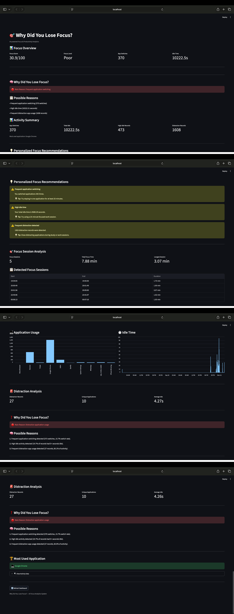

# 🎯 Why Did You Lose Focus? AI

An AI-powered focus and productivity analytics system that monitors computer activity, analyzes distraction patterns, predicts focus state, identifies probable reasons for focus loss, and provides personalized recommendations.

---

## 🧠 Project Overview

**Why Did You Lose Focus? AI** is designed to answer a simple question:

> **"Why did I lose focus?"**

Instead of only measuring screen time, the system analyzes multiple activity patterns such as:

- Application switching
- Idle time
- Application usage
- Distraction activity
- Focus sessions
- Session duration
- Recent activity patterns

The system combines activity analysis, feature engineering, machine learning, and an interactive Streamlit dashboard to provide actionable focus insights.

---

## ✨ Key Features

### 🖥️ Activity Tracking

- Detects the currently active application
- Tracks application activity
- Detects application switching
- Records idle activity
- Stores activity data for analysis

### 📊 Focus Analytics

- Calculates a Focus Score out of 100
- Determines the current Focus Level
- Analyzes application switching
- Measures total idle time
- Detects distraction activity
- Identifies focus sessions

### 🤖 Machine Learning

The project uses machine learning to predict the user's focus state based on activity-related features.

The system can provide:

- Focus prediction
- Prediction confidence
- Current activity analysis
- Focused vs distracted state

### 🧠 "Why Did You Lose Focus?"

The system analyzes activity patterns and identifies probable reasons for focus loss, including:

- Frequent application switching
- High idle activity
- Frequent distraction-app usage

### 💡 Personalized Recommendations

Based on detected behavior, the system generates personalized recommendations such as:

- Reducing unnecessary application switching
- Using focused work sessions
- Closing distracting applications
- Maintaining healthier work patterns

### 📈 Interactive Dashboard

The Streamlit dashboard provides:

- Focus Overview
- Focus Score
- Focus Level
- Application Switch Count
- Idle Time
- Possible Focus-Loss Reasons
- Activity Summary
- Focus Session Analysis
- Application Usage Charts
- Distraction Analysis
- Most Used Application
- Personalized Recommendations
- Activity Data

---

## 🏗️ System Architecture

```text
Computer Activity
       │
       ▼
Activity Tracker
       │
       ▼
Activity Data
       │
       ▼
Feature Engineering
       │
       ├───────────────┐
       ▼               ▼
 Focus Score       ML Prediction
       │               │
       └───────┬───────┘
               ▼
        Focus Analysis
               │
               ▼
     "Why Did You Lose Focus?"
               │
               ▼
   Personalized Recommendations
               │
               ▼
      Streamlit Dashboard
```

---

## 🛠️ Tech Stack

| Technology | Purpose |
|---|---|
| Python | Core development |
| Pandas | Data analysis and processing |
| NumPy | Numerical operations |
| Scikit-learn | Machine Learning |
| Joblib | ML model saving and loading |
| Psutil | System activity monitoring |
| Streamlit | Interactive dashboard |
| Streamlit Autorefresh | Live dashboard updates |
| Git | Version control |
| GitHub | Repository management |

---

## 📁 Project Structure

```text
why-did-you-lose-focus/
│
├── data/
│   └── Generated activity and feature data
│
├── models/
│   └── Trained ML models
│
├── src/
│   ├── activity_tracker.py
│   ├── analyze_activity.py
│   ├── dashboard.py
│   ├── feature_engineering.py
│   ├── focus_reason.py
│   ├── focus_score.py
│   ├── focus_sessions.py
│   ├── main.py
│   ├── predict_focus.py
│   ├── realtime_monitor.py
│   ├── recommendations.py
│   └── train_model.py
│
├── .gitignore
├── README.md
└── requirements.txt
```

> Note: The local `venv/` directory is intentionally excluded from GitHub using `.gitignore`.

---

## 🚀 How to Run

### 1. Clone the Repository

```bash
git clone https://github.com/nabeel-khanx7/why-did-you-lose-focus.git
cd why-did-you-lose-focus
```

### 2. Create a Virtual Environment

```bash
python3 -m venv venv
```

### 3. Activate the Virtual Environment

For macOS/Linux:

```bash
source venv/bin/activate
```

### 4. Install Dependencies

```bash
pip install -r requirements.txt
```

### 5. Run the Project

```bash
python src/main.py
```

The application will start the activity tracker and launch the Streamlit dashboard.

### Run Dashboard Separately

You can also launch the dashboard directly:

```bash
streamlit run src/dashboard.py
```

---

## 📊 Example Analysis

Example output generated by the system:

```text
Focus Score        : 31.0 / 100
Focus Level        : Poor
App Switches       : 363
Total Idle Time    : 9870.1 seconds

Main Reason:
Frequent application switching

Possible Reasons:
1. Frequent application switching
2. High idle time
3. Frequent distraction-app usage
```

> **Note:** These values are example results and may change depending on the collected activity data.

---

## 🖥️ Dashboard Preview

The interactive Streamlit dashboard provides a real-time view of the user's activity and focus patterns.

It includes:

- Focus Score
- Focus Level
- ML Prediction
- Prediction Confidence
- Application Usage
- Idle Time
- Distraction Analysis
- Focus Sessions
- Focus-Loss Reasons
- Personalized Recommendations
- Raw Activity Data

### Dashboard Screenshot

### Dashboard Screenshot



The system follows a multi-stage pipeline:

```text
Computer Activity
       ↓
Activity Collection
       ↓
Feature Engineering
       ↓
Focus Score Calculation
       ↓
Machine Learning Prediction
       ↓
Focus Reason Analysis
       ↓
Personalized Recommendations
       ↓
Streamlit Dashboard
```

The machine learning model uses activity-related features such as:

- Idle time
- Application switching
- Rolling idle behavior
- Switch count
- Distraction activity
- Hour
- Minute

These features are used to predict whether the current activity pattern represents a focused or distracted state.

---

## 🔍 Focus-Loss Analysis

The system does not only identify whether the user is distracted.

It also attempts to explain **why** focus may have been lost.

Possible reasons include:

### Frequent Application Switching

Repeatedly switching between applications can indicate fragmented attention.

### High Idle Time

Long periods of inactivity may indicate that the user is not actively working.

### Frequent Distraction-App Usage

Repeated usage of applications classified as distractions can contribute to reduced focus.

The system combines these activity signals to generate a probable main reason and supporting reasons.

---

## 💡 Personalized Recommendations

The recommendation engine analyzes the collected activity patterns and generates suggestions based on detected behavior.

Examples include:

- Reduce unnecessary application switching
- Take structured focus sessions
- Close or minimize distracting applications
- Reduce long idle periods
- Maintain consistent work patterns

The recommendations are generated from the user's collected activity data rather than using the same message for every situation.

---

## 📈 Focus Score

The system calculates a Focus Score between **0 and 100**.

The score considers activity patterns such as:

- Application switching rate
- Idle activity
- Distraction activity

The system also categorizes the score into different focus levels.

```text
80+     → Excellent
65–79   → Good
45–64   → Moderate
Below 45 → Poor
```

---

## 🔮 Future Improvements

Planned improvements include:

- Improve ML performance using larger datasets
- Add more behavioral features
- Add daily and weekly productivity reports
- Add focus trend visualization
- Build user-specific model personalization
- Improve distraction classification
- Add automated testing
- Add cloud deployment support
- Add production-ready monitoring

---

## 📌 Project Status

| Component | Status |
|---|---|
| Activity Tracking | ✅ Complete |
| Feature Engineering | ✅ Complete |
| Focus Score | ✅ Complete |
| ML Model | ✅ Complete |
| Real-Time Prediction | ✅ Complete |
| Focus Reason Detection | ✅ Complete |
| Personalized Recommendations | ✅ Complete |
| Streamlit Dashboard | ✅ Complete |
| Git/GitHub Integration | ✅ Complete |
| Cloud Deployment | 🔄 Planned |

---

## ⚠️ Current Limitations

- The quality of predictions depends on the amount and quality of collected activity data.
- Focus labels are generated from activity-based rules rather than manually labeled human data.
- The current activity tracker is designed for local computer activity monitoring.
- Machine learning performance can improve with a larger and more diverse dataset.
- Cloud deployment of the complete live activity-tracking system requires additional architecture because local computer activity cannot directly be monitored by a remote server.

---

## 🎯 Project Goal

The long-term goal of **Why Did You Lose Focus? AI** is to build a personal AI productivity assistant that can:

```text
Observe → Understand → Predict → Explain → Recommend
```

Instead of simply telling the user:

> **"You were distracted."**

the system aims to answer:

> **"You were distracted because of these activity patterns, and here is what you can do about it."**

---

## 👨‍💻 Author

**Nabeel Raza Khan**

AI/ML Engineering Student

GitHub: [@nabeel-khanx7](https://github.com/nabeel-khanx7)

---

## ⭐ Project

If you find this project interesting, consider giving it a ⭐ on GitHub.